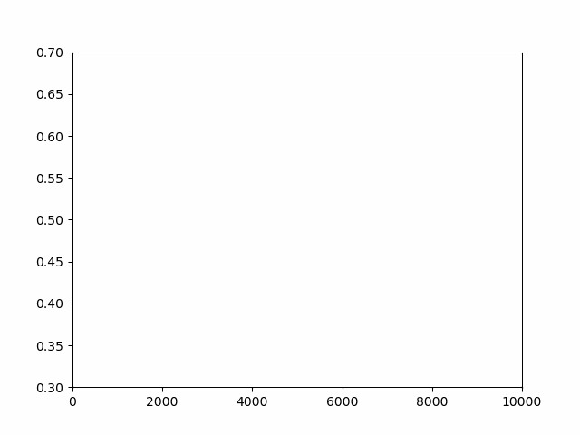
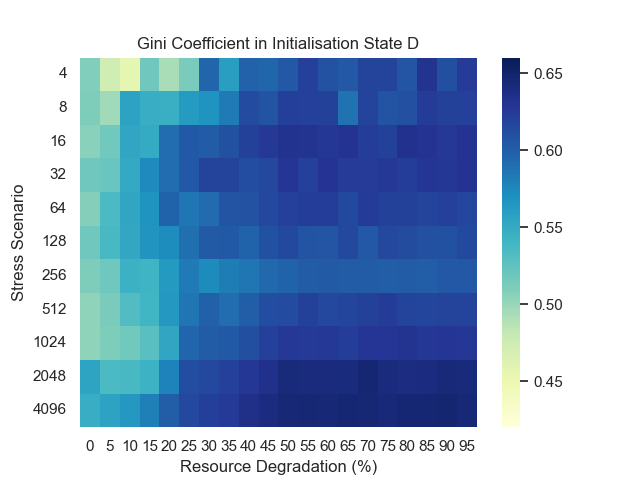

# NeoCOOP

## Description

This is a rust port of an agent-based model by [Brandon Gower-Winter](https://github.com/BrandonGower-Winter). [The original model](https://github.com/BrandonGower-Winter/NeoCOOP) is described as "An Agent-Based Model simulating the emergence and evolution of altruistic and selfish behaviour in Neolithic Households under varying degrees of environmental stress."

## Visualisation


The black pixels are settlements, the grey pixels are claimed areas of land that the settlements use to produce resources and the white pixels are unclaimed areas of land. For a deeper description of the semantics, read the paper below.



This is a visualisation of the average cooperation in a world changing over time. This is how likely the average family unit is to share resources with another family unit.



This shows egalitarianism 

## Research

You can read the paper [here](paper.pdf).

### Abstract

This project reimplements NeoCOOP, an agent-based model, in order to study egalitarianism in hunter-gatherer societies. Neo-COOP was initially developed to study the influence of environmental stress on cooperation in socially-stratified societies. The reimplementation uses the Rust programming language for greater performance, specifically via parallelization of many parts of the simulations. It also introduces the concept of resource degradation, where agents’ accumulated resources diminish by a specific percentage each iteration. This allows for new emergent behavior to be studied. At lower degradation levels, findings aligned closely with the original version of NeoCOOP’s results, which increases the validity of the new implementation as the previous implementation had no resource degradation. However, the greater result is that it is apparent that egalitarianism is critically depen-dent on resource degradation, as clearly displayed by simulations with higher levels of degradation. This new data offers insights into resource-sharing dynamics within simulated societies, which can then be applied to real-world scenarios with limited resources or high levels of resource degradation. Such results show how, as a species, decreasing levels of resource degradation could have led to increased egalitarianism in our societies.

## Usage

### Execution

Output of `cargo run -- -h`:
```
An agent-based model of Neolithic hunter-gatherers

Usage: neo [OPTIONS]
    or cargo run [--release?] -- [OPTIONS]

Options:
  -v, --visualise           Whether to visualise a simulation and ignore other arguments
  -r, --release-resolution  Release resolution produces finer data
  -p, --purge-results       Whether to purge previous results
  -h, --help                Print help
  -V, --version             Print version
```

### Results

The results produced are a collection of `.csv` files that store information about each iteration. This includes the number of settlements, the number of family units, the average and max resources belonging to a single family unit, measures of cooperation in the world, and measures of egalitarianism (the Gini coefficient) in the world.
